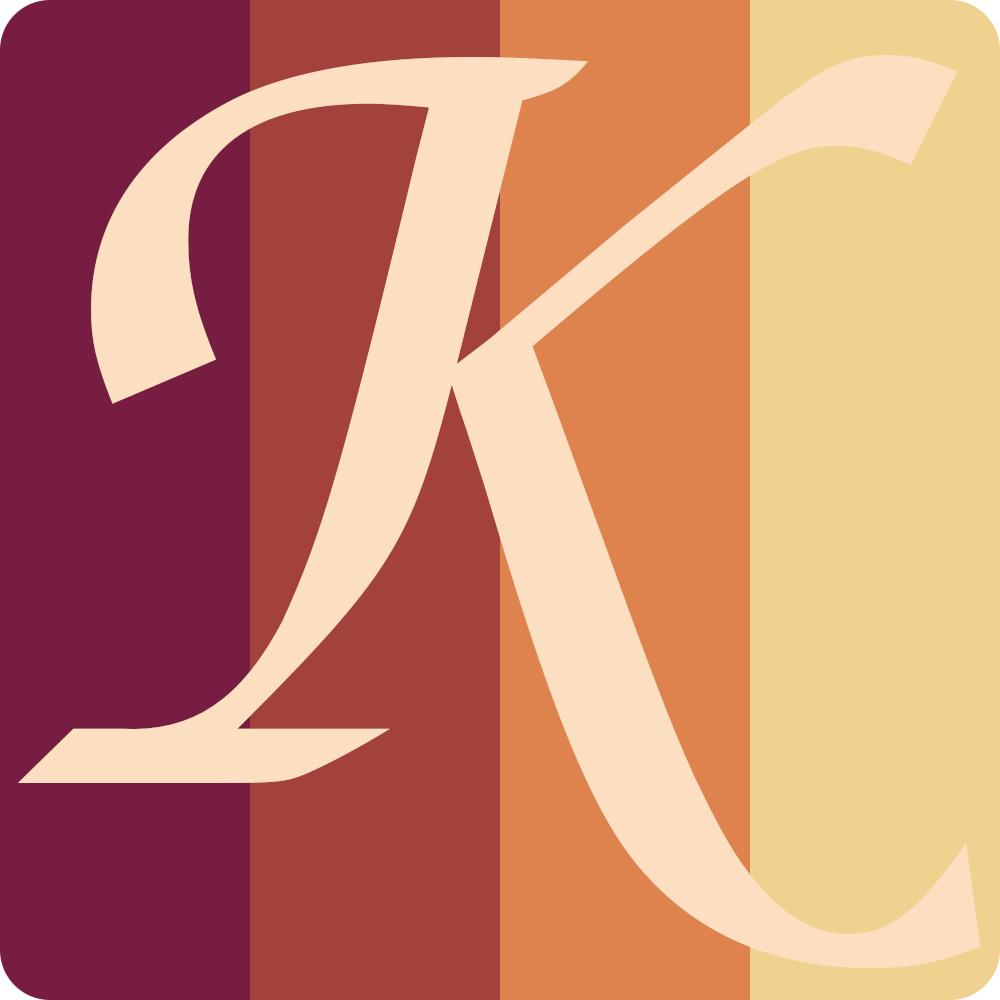

# The Kyra programming language

<p align="center">
	
</p>

```
print "Hello World";
```

## What is Kyra?
Kyra aims to be fun!

It is a mix of functional and object oriented concepts with a short but precise syntax.

## Contribute
If you want to hack on Kyra yourself, just do it!

I'll put some ideas I have for the language in [Ideas](https://github.com/users/LukasPietzschmann/projects/4).
You can add your own there, too.

## How to build it?
Just follow those easy steps:
1. Create a new build directory in the projects root
2. Within this folder you can execute `cmake ..` to create a build-file
3. Now you can run use your favourite build tool to compile everything (`make kyra`)
